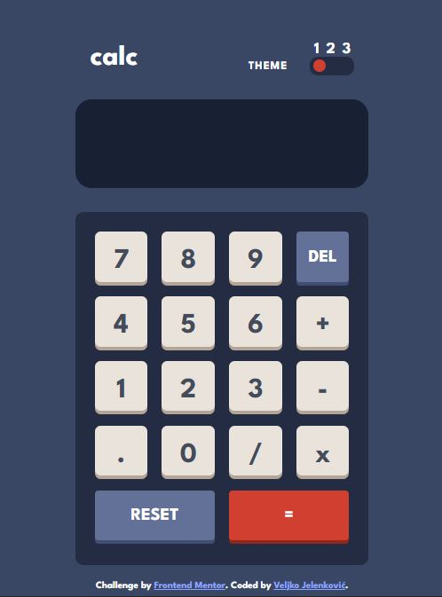
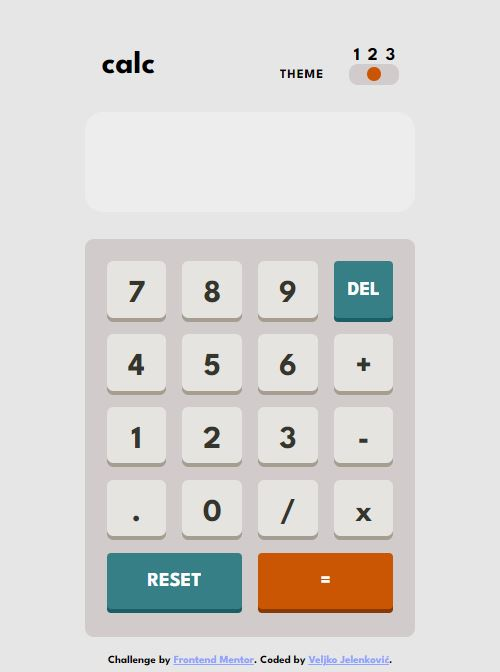
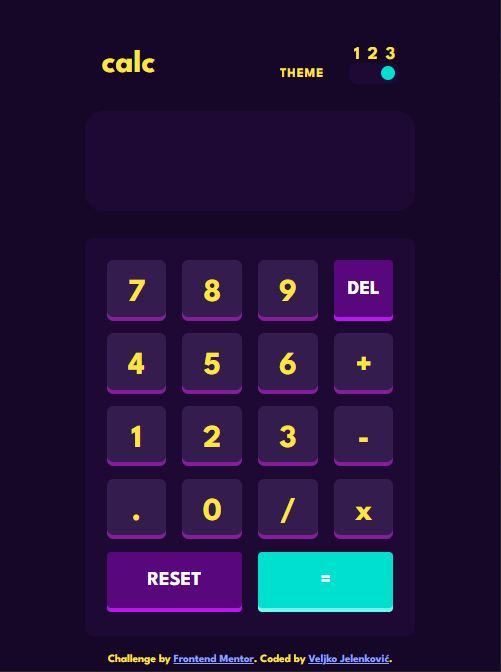

# Calculator App

A simple calculator app made with JavaScript, with operations like addition, subtraction, multiplication, and division, and possibility to change the theme of the calculator.

## Table of contents

- [Overview](#overview)
  - [Screenshot](#screenshot)
  - [Links](#links)
- [Process](#process)
  - [Built with](#built-with)
- [Author](#author)

## Overview

Users should be able to:

- See the size of the elements adjust based on their device's screen size
- Perform mathematical operations like addition, subtraction, multiplication, and division
- Adjust the color theme based on their preference, having to choose between three themes

### Screenshot

Themes available:

 

### Links

- Live Site URL: [Calculator App](https://jelenkoo10.github.io/calculator_app/)

## Process

### Built with

- Semantic HTML5 markup
- CSS custom properties
- CSS variables
- Flexbox
- CSS Grid
- Mobile-first workflow

## Author

- GitHub - [https://github.com/jelenkoo10](https://github.com/jelenkoo10)
- Frontend Mentor - [@jelenkoo10](https://www.frontendmentor.io/profile/jelenkoo10)

